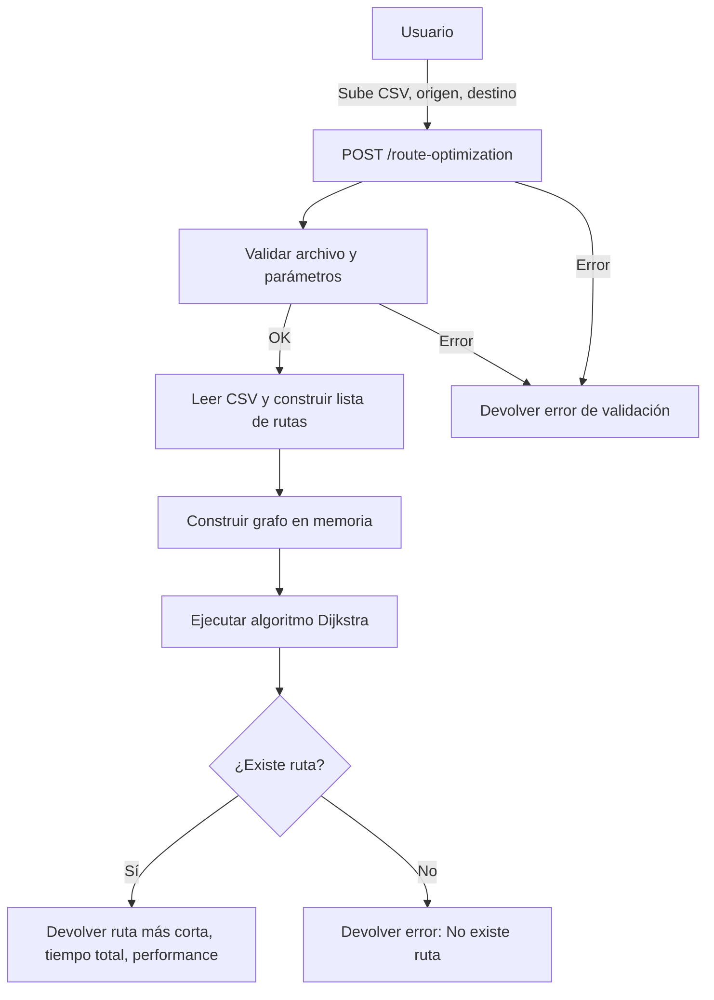

<div id="header" align="center">
  
  <h1>Solución a la prueba!</h1>
  <h3>Mini resumen de lo que se pide y cómo se abordó</h3>
</div>

---

# API Komatsu Route Optimizer - Documentación

## Descripción General
API REST para la optimización de rutas, que dado un archivo CSV con tiempos de viaje entre ubicaciones y un par de ubicaciones (origen y destino), devuelve la ruta más rápida y el tiempo total de viaje utilizando el algoritmo de Dijkstra.

---

## Endpoint
`POST /route-optimization`

---

## Flujo Principal

1. **Carga y Validación del Archivo CSV**
   - El usuario adjunta un archivo CSV con el formato:  
     `loc_start;loc_end;time`
   - El backend valida el formato y los datos.

2. **Construcción del Grafo**
   - Se transforma la lista de rutas en un grafo dirigido en memoria.
   - Cada nodo representa una ubicación, y cada arista un tiempo de viaje.

3. **Cálculo de la Ruta Más Rápida**
   - Se utiliza el algoritmo de Dijkstra para encontrar la ruta más corta (en tiempo) entre el origen y el destino.
   - Se mide el tiempo de procesamiento para asegurar que la respuesta sea menor a 300ms.

4. **Respuesta**
   - Se retorna la ruta óptima, el tiempo total, el origen, el destino y métricas de performance.

---

## Ejemplo de Request

```bash
POST /route-optimization
Content-Type: multipart/form-data

file: archivo.csv
inicio: CP1
fin: R20
```

---

## Ejemplo de Respuesta Exitosa

```json
{
  "success": true,
  "message": "Ruta más corta encontrada",
  "inicio": "CP1",
  "fin": "R20",
  "ruta": ["CP1", "CP2", "R20"],
  "tiempoTotal": 74,
  "performance": {
    "csvReadTimeMs": 2,
    "graphBuildTimeMs": 2,
    "dijkstraTimeMs": 0,
    "meetsTarget": true
  }
}
```

---

## Ejemplo de Respuesta de Error

```json
{
  "success": false,
  "message": "La ubicación de inicio 'X' no existe en el archivo"
}
```

---

## Justificación de Decisiones Técnicas

- **Algoritmo de Dijkstra:**  
  Elegido por ser el estándar para encontrar rutas más cortas en grafos con pesos positivos, garantizando eficiencia incluso con archivos de hasta 10.000 filas.
- **Endpoint Unificado:**  
  Se optó por un solo endpoint para simplificar la experiencia del usuario y reducir la complejidad del API.
- **Estructuras de Datos Eficientes:**  
  Uso de `HashMap` para el grafo y `PriorityQueue` para Dijkstra, optimizando la velocidad de acceso y procesamiento.
- **Java 21 + Spring Boot:**  
  Cumple con los requisitos del desafío y aprovecha las últimas mejoras del lenguaje y framework.
- **Pruebas Unitarias:**  
  Se incluyó un set de pruebas automáticas usando archivos en la carpeta `test_csvs` para validar rendimiento y exactitud en distintos escenarios.

---

## Escenarios de Prueba Específicos

- **Chain:**  
  Origen: A, Destino: Z (máxima distancia).  
  Debe explorar toda la cadena.

- **Dense:**  
  Origen: A, Destino: B (muchas rutas alternativas).  
  Debe evaluar todas las opciones.

- **Sparse:**  
  Origen: A, Destino: Z (puede no existir ruta).  
  Debe manejar casos sin solución.

- **Grid:**  
  Origen: esquina superior izquierda, Destino: esquina inferior derecha.  
  Múltiples rutas de igual costo para exigir la optimización y detectar cuellos de botella.

---

## Métricas de Performance

- El cálculo de la ruta debe ejecutarse en menos de **300ms** por solicitud.
- El sistema fue probado con archivos de hasta **10.000 filas** sin degradación significativa.

---

## Estructura de Archivos de Prueba

```
test_csvs/
├── chain_pequeño_2000.csv
├── dense_pequeño_2000.csv
├── sparse_pequeño_2000.csv
├── grid_pequeño_2000.csv
├── ... (archivos para 5000, 8000, 10000 filas)
```

---

## Diagrama de Flujo



---